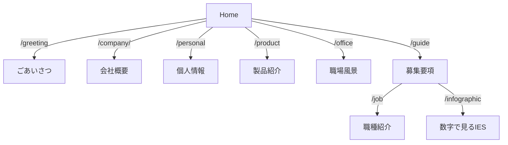
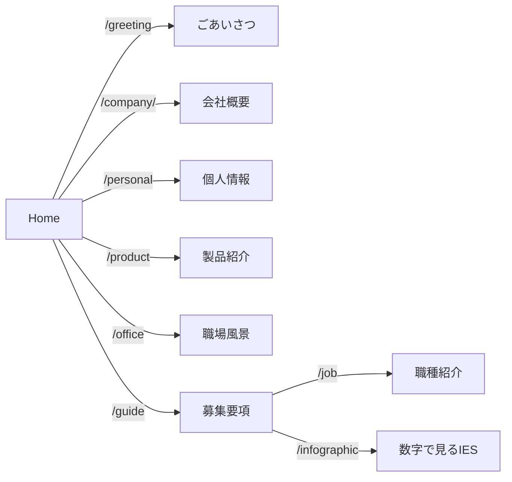
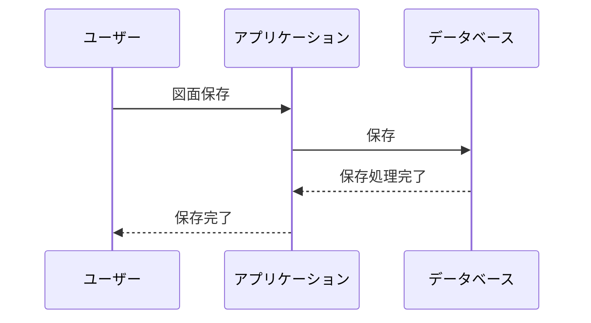
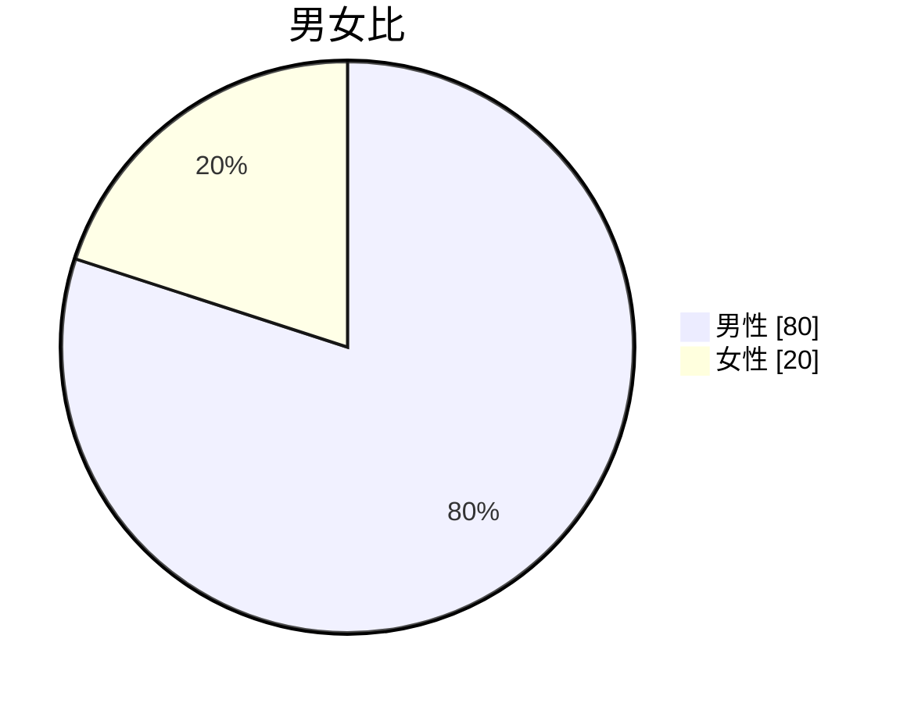
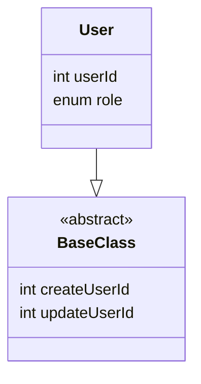
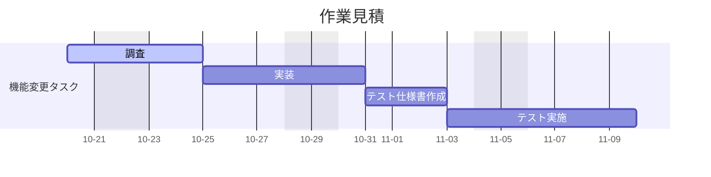

## グラフTD(Top to Down)

```mermaid
  graph TD;
    Home --"/greeting" --> Greeting["ごあいさつ"];
    Home --"/company/" --> Company["会社概要"];
    Home --"/personal" --> Personal["個人情報"];
    Home --"/product" --> Product["製品紹介"];
    Home --"/office" --> Office["職場風景"];
    Home --"/guide" --> Guide["募集要項"];
    Guide -- "/job" --> Job["職種紹介"]
    Guide -- "/infographic" --> InfoGraph["数字で見るIES"]
```
## グラフLR(Left to Right)

```mermaid
  graph LR;
    Home --"/greeting" --> Greeting["ごあいさつ"];
    Home --"/company/" --> Company["会社概要"];
    Home --"/personal" --> Personal["個人情報"];
    Home --"/product" --> Product["製品紹介"];
    Home --"/office" --> Office["職場風景"];
    Home --"/guide" --> Guide["募集要項"];
    Guide -- "/job" --> Job["職種紹介"]
    Guide -- "/infographic" --> InfoGraph["数字で見るIES"]
```
## シーケンス図

```mermaid
  sequenceDiagram
    ユーザー ->> アプリケーション: 図面保存
    アプリケーション ->> データベース: 保存
    データベース -->> アプリケーション: 保存処理完了
    アプリケーション -->> ユーザー: 保存完了
```
## 円グラフ

```mermaid
  pie showData
    title 男女比
    "男性": 80
    "女性": 20
```
## クラス図

```mermaid
classDiagram
  class BaseClass {
    <<abstract>>
    int createUserId
    int updateUserId
  }
  class User{
    int userId
    enum role
  }
  User --|> BaseClass
```

## ガントチャート

```mermaid
  gantt
    title 作業見積
    dateFormat YYYY/MM/DD
    axisFormat %m-%d
    excludes weekends
    todayMarker stroke-width:5px,stroke:red,opacity:0.5
    section 機能変更タスク
    調査 : active, task1, 2023/10/20, 3d
    実装 : task2, after task1, 4d
    テスト仕様書作成 : task3, after task2, 3d
    テスト実施 : task4, after task3, 5d
```
